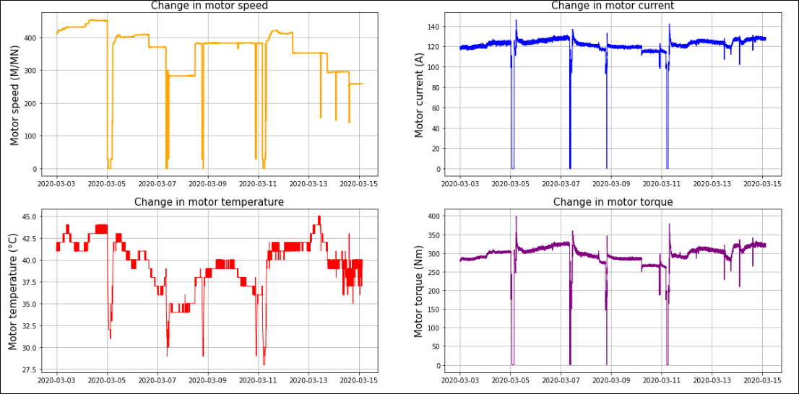

# Детектирование аномалий технологического процесса производства БОПП-пленки

## Описание технологического процесса

Производство БОПП-пленки - сложный технологический процесс, одним из этапов которого - поперечное растяжение пленки. Данную функцию выполняет установка поперечной ориентации. В процессе растяжения двигатели на входе и выходе установки должны быть синхронизированы, поэтому любое отклонение процесса от своего нормального хода течения, приводит к остановке оборудования и в следствии этого к большим экономическим потерям. Поэтому важнейшей задачей является детектирование аномалий параметров двигателей установки.

  
  Рисунок 1 - Установка поперечного ориентирования

## Набор данных
Данные представляют собой параметры двигателей, а конкретнее - скорость. Представлены в форме временных рядов с периодом в одну секунду.

  
  Рисунок 2 - Параметры двигателей

## Методы, используемые для поиска аномалий
В исследовании использовались следующие методы, представленные на рисунке 3:

  

  Рисунок 3 - Методы поиска аномалий

